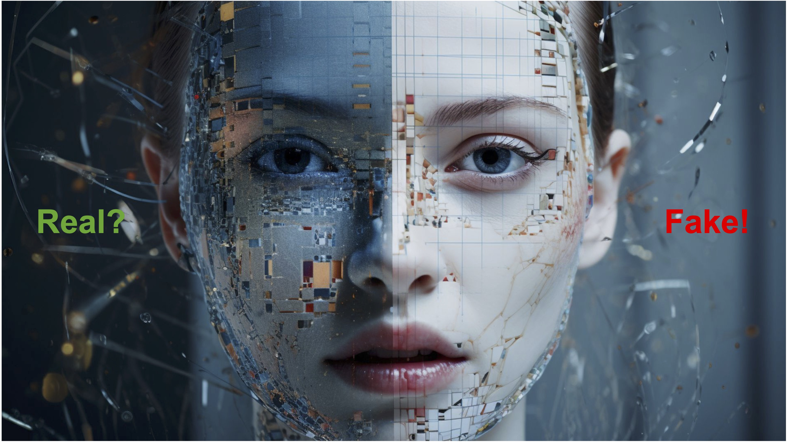

# Awesome Deepfakes Detection

<small>*(image from internet)*</small>

A collection list of Deepfakes Detection related datasets, tools, papers, and code. If this list helps you on your research, a star will be my pleasure :)

If you want to contribute to this list, welcome to send me a pull request or contact me :)

This repository only collects papers related to Deepfake Detection. If you are also interested in Deepfakes generation, please refer to: [Awesome Deepfakes](https://github.com/Daisy-Zhang/Awesome-Deepfakes).

## Contents

- [Datasets](#datasets)
- [Competitions](#competitions)
- [Tools](#tools)
- [Recent Conference Papers](#recent-conference-papers)
- [Survey](#survey)
- [Spatiotemporal Based](#spatiotemporal-based)
- [Frequency Based](#frequency-based)
- [Generalization](#generalization)
- [Interpretability](#interpretability)
- [Human-Decision](#human-decision)
- [Localization](#localization)
- [Multi-modal Based](#multi-modal-based)
- [Biological Signal](#biological-signal)
- [Robustness](#robustness)
- [Fairness](#fairness)
- [Fingerprint/Watermark](#fingerprint-watermark)
- [Identity-Related](#identity-related)
- [Adversarial Attack](#adversarial-attack)
- [Real Scenario](#real-scenario)
- [Anomaly Detection](#anomaly-detection)
- [Self-Supervised Learning](#self-supervised-learning)
- [Source Model Attribution](#source-model-attribution)
- [Multiclass Classification](#multiclass-classification)
- [Federated Learning](#federated-learning)
- [Knowledge Distillation](#knowledge-distillation)
- [Meta-Learning](#meta-learning)
- [Depth Based](#depth-based)

## Datasets

### Video Datasets

* **UADFV**: Exposing Deep Fakes Using Inconsistent Head Poses. [Paper](https://arxiv.org/abs/1811.00661)
* **EBV**: In Ictu Oculi: Exposing AI Generated Fake Face Videos by Detecting Eye Blinking. [Paper](https://arxiv.org/abs/1806.02877)    [Download](http://www.cs.albany.edu/~lsw/downloads.html)
* **Deepfake-TIMIT**: DeepFakes: a New Threat to Face Recognition? Assessment and Detection. [Paper](https://arxiv.org/abs/1812.08685)    [Download](https://conradsanderson.id.au/vidtimit/)
* **DFFD**: On the Detection of Digital Face Manipulation. [Paper](http://cvlab.cse.msu.edu/pdfs/dang_liu_stehouwer_liu_jain_cvpr2020.pdf)    [Download](http://cvlab.cse.msu.edu/dffd-dataset.html)
* **DeepfakeDetection**: [Download](https://ai.googleblog.com/2019/09/contributing-data-to-deepfake-detection.html)
* **Celeb-DF (v1)**: Celeb-DF: A Large-scale Challenging Dataset for DeepFake Forensics. [Paper](https://openaccess.thecvf.com/content_CVPR_2020/papers/Li_Celeb-DF_A_Large-Scale_Challenging_Dataset_for_DeepFake_Forensics_CVPR_2020_paper.pdf)    [Download](https://github.com/yuezunli/celeb-deepfakeforensics/tree/master/Celeb-DF-v1)
* **Celeb-DF (v2)**: Celeb-DF: A Large-scale Challenging Dataset for DeepFake Forensics. [Paper](https://openaccess.thecvf.com/content_CVPR_2020/papers/Li_Celeb-DF_A_Large-Scale_Challenging_Dataset_for_DeepFake_Forensics_CVPR_2020_paper.pdf)    [Download](https://github.com/yuezunli/celeb-deepfakeforensics/tree/master/Celeb-DF-v2)
* **DFDC**: The DeepFake Detection Challenge (DFDC) Dataset. [Paper](https://arxiv.org/abs/2006.07397)    [Download](https://www.kaggle.com/c/deepfake-detection-challenge/data) 
* **FaceForensic++**: FaceForensics++: Learning to Detect Manipulated Facial Images. [Paper](https://arxiv.org/abs/1901.08971)    [Download](https://github.com/ondyari/FaceForensics)
* **FFIW-10K**: Face Forensics in the Wild. [Paper](https://arxiv.org/abs/2103.16076)    [Download](https://github.com/tfzhou/FFIW)
* **Deeper Forensic-1.0**: DeeperForensics-1.0: A Large-Scale Dataset for Real-World Face Forgery Detection. [Paper](https://openaccess.thecvf.com/content_CVPR_2020/papers/Jiang_DeeperForensics-1.0_A_Large-Scale_Dataset_for_Real-World_Face_Forgery_Detection_CVPR_2020_paper.pdf)    [Download](https://github.com/EndlessSora/DeeperForensics-1.0)
* **Wild Deepfake**: WildDeepfake: A Challenging Real-World Dataset for Deepfake Detection. [Paper](https://arxiv.org/abs/2101.01456)    [Download](https://github.com/deepfakeinthewild/deepfake-in-the-wild)
* **ForgeryNet**: ForgeryNet: A Versatile Benchmark for Comprehensive Forgery Analysis. [Paper](https://arxiv.org/abs/2103.05630)    [Download](https://github.com/yinanhe/forgerynet)
* **WLDR**: Protecting World Leaders Against Deep Fakes. [Paper](https://openaccess.thecvf.com/content_CVPRW_2019/papers/Media%20Forensics/Agarwal_Protecting_World_Leaders_Against_Deep_Fakes_CVPRW_2019_paper.pdf)
* **FakeAVCeleb**: FakeAVCeleb: A Novel Audio-Video Multimodal Deepfake Dataset. [Paper](https://datasets-benchmarks-proceedings.neurips.cc/paper_files/paper/2021/file/d9d4f495e875a2e075a1a4a6e1b9770f-Paper-round2.pdf) [Download](https://github.com/DASH-Lab/FakeAVCeleb)
* **DeepSpeak**: DeepSpeak Dataset v1.0. [Paper](https://arxiv.org/abs/2408.05366) [Download](https://huggingface.co/datasets/faridlab/deepspeak_v1)
* **IDForge**: IDForge: An Identity-driven Multimedia Forgery Dataset. [Paper](https://arxiv.org/abs/2401.11764) [Download](https://github.com/xyyandxyy/IDForge)
* **Celeb-DF++**: Celeb-DF++: A Large-scale Challenging Video DeepFake Benchmark for Generalizable Forensics. [Paper](https://arxiv.org/abs/2507.18015) [Download](https://github.com/OUC-VAS/Celeb-DF-PP)

|                     | Real Videos | Fake Videos | Year |                             Note                                                    |
| :-----------------: | :---------: | :---------: | :--: | :---------------------------------------------------------------------------------: |
|        UADFV        |     49      |     49      | 2018 | focus on head pose                                                                  |
|         EBV         |      -      |     49      | 2018 | focus on eye blinking                                                               |
|   Deepfake-TIMIT    |     320     |     640     | 2018 | GAN-Based methods                                                                   |
|        DFFD         |    1,000    |    3000     | 2019 | mutiple SOTA methods                                                                |
|  DeepfakeDetection  |     363     |    3,068    | 2019 | collect from actors with publicly available generation methods                      |
|    Celeb-DF (v2)    |     590     |    5639     | 2019 | high quality                                                                        |
|        DFDC         |   23,564    |   104,500   | 2019 | DFDC competition on Kaggle                                                          |
|   FaceForensic++    |    1,000    |    5,000    | 2019 | five different generation methods                                                   |
|      FFIW-10K       |   10,000    |   10,000    | 2019 | mutiple faces in one frame                                                          |
|        WLDR         |      -      |      -      | 2019 | person of interest video from Youtube                                               |
| DeeperForensics-1.0 |   50,000    |   10,000    | 2020 | add real-world perturbations                                                        |
|    Wild-Deepfake    |    3,805    |    3,509    | 2021 | collect from Internet                                                               |
|     ForgeryNet      |   99,630    |   121,617   | 2021 | 8 video-level generation methods, add perturbations                                 |
|     FakeAVCeleb     |      500    |   19,500    | 2021 | audio-visual multi-modalies dataset                                                 |
|      DeepSpeak      |    6,226    |    6,799    | 2024 | lip-sync and face-swap deepfakes with audio manipulated                             |
|       IDForge       |   79,827    |   169,311   | 2024 | multi-modalies dataset with extra identity information, high quality                |
|    Celeb-DF++       |     590     |    53,196   | 2025 | large-scale and challenging video benchmark for generlization                       |

### Image Datasets

* **DFFD**: On the Detection of Digital Face Manipulation. [Paper](https://openaccess.thecvf.com/content_CVPR_2020/papers/Dang_On_the_Detection_of_Digital_Face_Manipulation_CVPR_2020_paper.pdf)    [Download](http://cvlab.cse.msu.edu/project-ffd.html)
* **iFakeFaceDB**: GANprintR: Improved Fakes and Evaluation of the State of the Art in Face Manipulation Detection. [Paper](https://arxiv.org/abs/1911.05351)    [Download](https://github.com/socialabubi/iFakeFaceDB)
* **100k Faces Generated by AI (Online)**: [Download](https://generated.photos/datasets)
* **DFGC**: DFGC 2021: A DeepFake Game Competition. [Paper](https://arxiv.org/abs/2106.01217)    [Dowload](https://github.com/bomb2peng/DFGC_starterkit)
* **ForgeryNet**: ForgeryNet: A Versatile Benchmark for Comprehensive Forgery Analysis. [Paper](https://arxiv.org/abs/2103.05630)    [Download](https://github.com/yinanhe/forgerynet)

|             | Real Images |    Fake Images     | Year |                         Note                          |
| :---------: | :---------: | :----------------: | :--: | :---------------------------------------------------: |
|    DFFD     |   58,703    |      240,336       | 2019 |                 mutiple SOTA methods                  |
| iFakeFaceDB |      -      | 87,000 (StyleGAN)  | 2020 |                 generated by StyleGAN                 |
| 100k Faces  |      -      | 100,000 (StyleGAN) | 2021 |                 generated by StyleGAN                 |
|    DFGC     |    1,000    |      N*1,000       | 2021 | DFGC 2021 competition, fake images generated by users |
| ForgeryNet  |  1,438,201  |     1,457,861      | 2021 |  7 image-level generation methods, add perturbations  |

## Competitions

|              Name               |                             Link                             | Year |                             Note                             |
| :-----------------------------: | :----------------------------------------------------------: | :--: | :----------------------------------------------------------: |
|  Deepfake Detection Challenge   | [Website](https://www.kaggle.com/c/deepfake-detection-challenge) | 2019 | 1. video-level detection. 2. use DFDC datasets.  3. the first worldwide competition.  4. more than 2,000 teams participated. |
|     DeepForensics Challenge     | [Website](https://competitions.codalab.org/competitions/25228) | 2020 | 1. video-level detection.  2. use DeeperForensics-1.0 datasets.  3. simulates real-world scenarios. |
|    Deepfake Game Competition    | [Website](https://competitions.codalab.org/competitions/29583) | 2021 | 1. both image-level generation and video-level detection track.  2. use Celeb-DF(v2) datasets. |
| Face Forgery Analysis Challenge | [Website](https://competitions.codalab.org/competitions/33386) | 2021 | 1. both image-level and video-level detection track.  2. addtional temporal localization track.  3. use ForgeryNet dataset. |

## Tools

* **Sensity**: [Website](https://sensity.ai/)
* **Deepware**: [Website](https://deepware.ai/)
* **Baidu Security**: [Website](http://weishi.baidu.com/product/deepfake)
* **DeepReal**: [Website](https://deepfakes.real-ai.cn/)

## Recent Conference Papers

### CVPR

* Exploiting Style Latent Flows for Generalizing Video Deepfake Detection, *CVPR* 2024: [Paper](https://arxiv.org/abs/2403.06592)
* AVFF: Audio-Visual Feature Fusion for Video Deepfake Detection, *CVPR* 2024: [Paper](https://arxiv.org/pdf/2406.02951v1)
* Transcending Forgery Specificity with Latent Space Augmentation for Generalizable Deepfake Detection, *CVPR* 2024: [Paper](https://arxiv.org/abs/2311.11278)
* Rethinking the Up-Sampling Operations in CNN-based Generative Network for Generalizable Deepfake Detection, *CVPR* 2024: [Paper](https://arxiv.org/abs/2312.10461) [Github](https://github.com/chuangchuangtan/NPR-DeepfakeDetection)
* LAA-Net: Localized Artifact Attention Network for Quality-Agnostic and Generalizable Deepfake Detection, *CVPR* 2024: [Paper](https://arxiv.org/pdf/2401.13856) [Github](https://github.com/10Ring/LAA-Net)
* Preserving Fairness Generalization in Deepfake Detection, *CVPR* 2024: [Paper](https://arxiv.org/pdf/2402.17229) [Github](https://github.com/Purdue-M2/Fairness-Generalization)
* Implicit Identity Leakage: The Stumbling Block to Improving Deepfake Detection Generalization, *CVPR* 2023: [Paper](https://openaccess.thecvf.com/content/CVPR2023/papers/Dong_Implicit_Identity_Leakage_The_Stumbling_Block_to_Improving_Deepfake_Detection_CVPR_2023_paper.pdf) [Github](https://github.com/megvii-research/CADDM)
* Implicit Identity Driven Deepfake Face Swapping Detection, *CVPR* 2023: [Paper](https://openaccess.thecvf.com/content/CVPR2023/papers/Huang_Implicit_Identity_Driven_Deepfake_Face_Swapping_Detection_CVPR_2023_paper.pdf)
* AltFreezing for More General Face Forgery Detection, *CVPR* 2023: [Paper](https://openaccess.thecvf.com/content/CVPR2023/papers/Wang_AltFreezing_for_More_General_Video_Face_Forgery_Detection_CVPR_2023_paper.pdf)
* AUNet: Learning Relations Between Action Units for Face Forgery Detection, *CVPR* 2023: [Paper](https://openaccess.thecvf.com/content/CVPR2023/papers/Bai_AUNet_Learning_Relations_Between_Action_Units_for_Face_Forgery_Detection_CVPR_2023_paper.pdf)
* Dynamic Graph Learning with Content-guided Spatial-Frequency Relation Reasoning for Deepfake Detection, *CVPR* 2023: [Paper](https://openaccess.thecvf.com/content/CVPR2023/papers/Wang_Dynamic_Graph_Learning_With_Content-Guided_Spatial-Frequency_Relation_Reasoning_for_Deepfake_CVPR_2023_paper.pdf)
* TruFor: Leveraging all-round clues for trustworthy image forgery detection and localization, *CVPR* 2023: [Paper](https://openaccess.thecvf.com/content/CVPR2023/papers/Guillaro_TruFor_Leveraging_All-Round_Clues_for_Trustworthy_Image_Forgery_Detection_and_CVPR_2023_paper.pdf) [Github](https://github.com/grip-unina/TruFor)
* Learning on Gradients: Generalized Artifacts Representation for GAN-Generated Images Detection, *CVPR* 2023: [Paper](https://openaccess.thecvf.com/content/CVPR2023/papers/Tan_Learning_on_Gradients_Generalized_Artifacts_Representation_for_GAN-Generated_Images_Detection_CVPR_2023_paper.pdf) [Github](https://github.com/chuangchuangtan/LGrad)
* Towards Universal Fake Image Detectors That Generalize Across Generative Models, *CVPR* 2023: [Paper](https://openaccess.thecvf.com/content/CVPR2023/papers/Ojha_Towards_Universal_Fake_Image_Detectors_That_Generalize_Across_Generative_Models_CVPR_2023_paper.pdf) [Github](https://github.com/Yuheng-Li/UniversalFakeDetect)
* DF-Platter: Multi-Face Heterogeneous Deepfake Dataset, *CVPR* 2023: [Paper](https://openaccess.thecvf.com/content/CVPR2023/papers/Narayan_DF-Platter_Multi-Face_Heterogeneous_Deepfake_Dataset_CVPR_2023_paper.pdf)
* Self-Supervised Video Forensics by Audio-Visual Anomaly Detection, *CVPR* 2023: [Paper](https://openaccess.thecvf.com/content/CVPR2023/papers/Feng_Self-Supervised_Video_Forensics_by_Audio-Visual_Anomaly_Detection_CVPR_2023_paper.pdf) [Github](https://github.com/cfeng16/audio-visual-forensics)
* Fake it till you make it: Learning transferable representations from synthetic ImageNet clones, *CVPR* 2023: [Paper](https://openaccess.thecvf.com/content/CVPR2023/papers/Sariyildiz_Fake_It_Till_You_Make_It_Learning_Transferable_Representations_From_CVPR_2023_paper.pdf) [Pretrained](https://europe.naverlabs.com/research/computer-vision/imagenet-sd/)
* Evading DeepFake Detectors via Adversarial Statistical Consistency, *CVPR* 2023: [Paper](https://openaccess.thecvf.com/content/CVPR2023/papers/Hou_Evading_DeepFake_Detectors_via_Adversarial_Statistical_Consistency_CVPR_2023_paper.pdf)
* Evading Forensic Classifiers with Attribute-Conditioned Adversarial Faces, *CVPR* 2023: [Paper](https://openaccess.thecvf.com/content/CVPR2023/papers/Shamshad_Evading_Forensic_Classifiers_With_Attribute-Conditioned_Adversarial_Faces_CVPR_2023_paper.pdf) [Github](https://github.com/koushiksrivats/face_attribute_attack)
* Detecting and Grounding Multi-Modal Media Manipulation, *CVPR* 2023: [Paper](https://openaccess.thecvf.com/content/CVPR2023/papers/Shao_Detecting_and_Grounding_Multi-Modal_Media_Manipulation_CVPR_2023_paper.pdf) [Github](https://github.com/rshaojimmy/MultiModal-DeepFake)
* Hierarchical Fine-Grained Image Forgery Detection and Localization, *CVPR* 2023: [Paper](https://openaccess.thecvf.com/content/CVPR2023/papers/Guo_Hierarchical_Fine-Grained_Image_Forgery_Detection_and_Localization_CVPR_2023_paper.pdf) [Github](https://github.com/CHELSEA234/HiFi_IFDL)
* Instance-Aware Domain Generalization for Face Anti-Spoofing, *CVPR* 2023: [Paper](https://openaccess.thecvf.com/content/CVPR2023/papers/Zhou_Instance-Aware_Domain_Generalization_for_Face_Anti-Spoofing_CVPR_2023_paper.pdf) [Github](https://github.com/qianyuzqy/IADG)
* Rethinking Domain Generalization for Face Anti-spoofing: Separability and Alignment, *CVPR* 2023: [Paper](https://openaccess.thecvf.com/content/CVPR2023/papers/Sun_Rethinking_Domain_Generalization_for_Face_Anti-Spoofing_Separability_and_Alignment_CVPR_2023_paper.pdf) [Github](https://github.com/sunyiyou/SAFAS)
* Learning Second Order Local Anomaly for General Face Forgery Detection, *CVPR* 2022: [Paper](https://openaccess.thecvf.com/content/CVPR2022/papers/Fei_Learning_Second_Order_Local_Anomaly_for_General_Face_Forgery_Detection_CVPR_2022_paper.pdf)
* DeepFake Disrupter: The Detector of DeepFake Is My Friend, *CVPR* 2022: [Paper](https://openaccess.thecvf.com/content/CVPR2022/papers/Wang_DeepFake_Disrupter_The_Detector_of_DeepFake_Is_My_Friend_CVPR_2022_paper.pdf)
* Protecting Celebrities from DeepFake with Identity Consistency Transformer, *CVPR* 2022: [Paper](https://arxiv.org/abs/2203.01318v3) [Github](https://github.com/LightDXY/ICT_DeepFake)
* Detecting Deepfakes with Self-Blended Images, *CVPR* 2022: [Paper](https://arxiv.org/abs/2204.08376) [Github](https://github.com/mapooon/SelfBlendedImages)
* Self-supervised Learning of Adversarial Example: Towards Good Generalizations for Deepfake Detection, *CVPR* 2022: [Paper](https://arxiv.org/abs/2203.12208) [Github](https://github.com/liangchen527/SLADD)
* End-to-End Reconstruction-Classification Learning for Face Forgery Detection, *CVPR* 2022: [Paper](https://vision.sjtu.edu.cn/files/cvpr22_RECCE.pdf)
* Robust Image Forgery Detection Against Transmission Over Online Social Networks, *CVPR* 2022: [Paper](https://ieeexplore.ieee.org/stamp/stamp.jsp?tp=&arnumber=9686650) [Github](https://github.com/HighwayWu/ImageForensicsOSN)
* Leveraging Real Talking Faces via Self-Supervision for Robust Forgery Detection, *CVPR* 2022: [Paper](https://arxiv.org/pdf/2201.07131.pdf)
* Exploring Frequency Adversarial Attacks for Face Forgery Detection, *CVPR* 2022: [Paper](https://arxiv.org/pdf/2203.15674.pdf)
* ForgeryNet: A Versatile Benchmark for Comprehensive Forgery Analysis, *CVPR* 2021: [Paper](https://arxiv.org/abs/2103.05630)    [Github](https://github.com/yinanhe/forgerynet)
* Representative Forgery Mining for Fake Face Detection, *CVPR* 2021: [Paper](https://openaccess.thecvf.com/content/CVPR2021/papers/Wang_Representative_Forgery_Mining_for_Fake_Face_Detection_CVPR_2021_paper.pdf)    [Github](https://github.com/crywang/RFM)
* MagDR: Mask-Guided Detection and Reconstruction for Defending Deepfakes, *CVPR* 2021: [Paper](https://openaccess.thecvf.com/content/CVPR2021/papers/Chen_MagDR_Mask-Guided_Detection_and_Reconstruction_for_Defending_Deepfakes_CVPR_2021_paper.pdf)
* Improving the Efficiency and Robustness of Deepfakes Detection Through Precise Geometric Features, *CVPR* 2021: [Paper](https://openaccess.thecvf.com/content/CVPR2021/papers/Sun_Improving_the_Efficiency_and_Robustness_of_Deepfakes_Detection_Through_Precise_CVPR_2021_paper.pdf)    [Github](https://github.com/frederickszk/LRnet)
* Multi-Attentional Deepfake Detection, *CVPR* 2021: [Paper](https://openaccess.thecvf.com/content/CVPR2021/html/Zhao_Multi-Attentional_Deepfake_Detection_CVPR_2021_paper.html)    [Github](https://github.com/yoctta/multiple-attention)
* Lips Don't Lie: A Generalisable and Robust Approach To Face Forgery Detection, *CVPR* 2021: [Paper](https://openaccess.thecvf.com/content/CVPR2021/papers/Haliassos_Lips_Dont_Lie_A_Generalisable_and_Robust_Approach_To_Face_CVPR_2021_paper.pdf)
* Spatial-Phase Shallow Learning: Rethinking Face Forgery Detection in Frequency Domain, *CVPR* 2021: [Paper](https://openaccess.thecvf.com/content/CVPR2021/papers/Liu_Spatial-Phase_Shallow_Learning_Rethinking_Face_Forgery_Detection_in_Frequency_Domain_CVPR_2021_paper.pdf)
* Frequency-Aware Discriminative Feature Learning Supervised by Single-Center Loss for Face Forgery Detection, *CVPR* 2021: [Paper](https://openaccess.thecvf.com/content/CVPR2021/papers/Li_Frequency-Aware_Discriminative_Feature_Learning_Supervised_by_Single-Center_Loss_for_Face_CVPR_2021_paper.pdf)
* Generalizing Face Forgery Detection With High-Frequency Features, *CVPR* 2021: [Paper](https://openaccess.thecvf.com/content/CVPR2021/papers/Luo_Generalizing_Face_Forgery_Detection_With_High-Frequency_Features_CVPR_2021_paper.pdf)
* Face Forgery Detection by 3D Decomposition, *CVPR* 2021: [Paper](https://openaccess.thecvf.com/content/CVPR2021/papers/Zhu_Face_Forgery_Detection_by_3D_Decomposition_CVPR_2021_paper.pdf)
* Global Texture Enhancement for Fake Face Detection in the Wild, *CVPR* 2020: [Paper](https://openaccess.thecvf.com/content_CVPR_2020/papers/Liu_Global_Texture_Enhancement_for_Fake_Face_Detection_in_the_Wild_CVPR_2020_paper.pdf)
* On the Detection of Digital Face Manipulation, *CVPR* 2020: [Paper](https://openaccess.thecvf.com/content_CVPR_2020/papers/Dang_On_the_Detection_of_Digital_Face_Manipulation_CVPR_2020_paper.pdf)    [Github](https://github.com/JStehouwer/FFD_CVPR2020)
* Face X-Ray for More General Face Forgery Detection, *CVPR* 2020: [Paper](https://openaccess.thecvf.com/content_CVPR_2020/papers/Li_Face_X-Ray_for_More_General_Face_Forgery_Detection_CVPR_2020_paper.pdf)
* CNN-generated images are surprisingly easy to spot... for now, *CVPR* 2020: [Paper](https://arxiv.org/abs/1912.11035)    [Github](https://github.com/PeterWang512/CNNDetection)
* Lost in Translation: Lip-Sync Deepfake Detection from Audio-Video Mismatch, *CVPR Workshop* 2024: [Paper](https://openaccess.thecvf.com/content/CVPR2024W/WMF/html/Bohacek_Lost_in_Translation_Lip-Sync_Deepfake_Detection_from_Audio-Video_Mismatch_CVPRW_2024_paper.html)
* CORE: Consistent Representation Learning for Face Forgery Detection, *CVPR Workshop* 2022: [Paper](https://openaccess.thecvf.com/content/CVPR2022W/WMF/papers/Ni_CORE_COnsistent_REpresentation_Learning_for_Face_Forgery_Detection_CVPRW_2022_paper.pdf) [Github](https://github.com/niyunsheng/CORE)
* FReTAL: Generalizing Deepfake Detection using Knowledge Distillation and Representation Learning, *CVPR Workshop* 2021: [Paper](https://openaccess.thecvf.com/content/CVPR2021W/WMF/papers/Kim_FReTAL_Generalizing_Deepfake_Detection_Using_Knowledge_Distillation_and_Representation_Learning_CVPRW_2021_paper.pdf)
* Towards Untrusted Social Video Verification to Combat Deepfakes via Face Geometry Consistency, *CVPR Workshop* 2020: [Paper](https://openaccess.thecvf.com/content_CVPRW_2020/papers/w39/Tursman_Towards_Untrusted_Social_Video_Verification_to_Combat_Deepfakes_via_Face_CVPRW_2020_paper.pdf)
* OC-FakeDect: Classifying Deepfakes Using One-class Variational Autoencoder, *CVPR Workshop* 2020: [Paper](https://openaccess.thecvf.com/content_CVPRW_2020/papers/w39/Khalid_OC-FakeDect_Classifying_Deepfakes_Using_One-Class_Variational_Autoencoder_CVPRW_2020_paper.pdf)
* Exposing DeepFake Videos By Detecting Face Warping Artifacts, *CVPR Workshop* 2019: [Paper](https://arxiv.org/abs/1811.00656)
* Recurrent Convolutional Strategies for Face Manipulation Detection in Videos, *CVPR Workshop* 2019: [Paper](https://arxiv.org/abs/1905.00582)
* Two-Stream Neural Networks for Tampered Face Detection, *CVPR Workshop* 2017: [Paper](https://arxiv.org/abs/1803.11276)

### ICCV

* Towards Understanding the Generalization of Deepfake Detectors from a Game-Theoretical View, *ICCV 2023*: [Paper](https://openaccess.thecvf.com/content/ICCV2023/papers/Yao_Towards_Understanding_the_Generalization_of_Deepfake_Detectors_from_a_Game-Theoretical_ICCV_2023_paper.pdf)
* Controllable Guide-Space for Generalizable Face Forgery Detection, *ICCV 2023*: [Paper](https://openaccess.thecvf.com/content/ICCV2023/papers/Guo_Controllable_Guide-Space_for_Generalizable_Face_Forgery_Detection_ICCV_2023_paper.pdf)
* TALL: Thumbnail Layout for Deepfake Video Detection, *ICCV 2023*: [Paper](https://openaccess.thecvf.com/content/ICCV2023/papers/Xu_TALL_Thumbnail_Layout_for_Deepfake_Video_Detection_ICCV_2023_paper.pdf) [Github](https://github.com/rainy-xu/TALL4Deepfake)
* Quality-Agnostic Deepfake Detection with Intra-model Collaborative Learning, *ICCV 2023*: [Paper](https://openaccess.thecvf.com/content/ICCV2023/papers/Le_Quality-Agnostic_Deepfake_Detection_with_Intra-model_Collaborative_Learning_ICCV_2023_paper.pdf)
* UCF: Uncovering Common Features for Generalizable Deepfake Detection, *ICCV 2023*: [Paper](https://openaccess.thecvf.com/content/ICCV2023/papers/Yan_UCF_Uncovering_Common_Features_for_Generalizable_Deepfake_Detection_ICCV_2023_paper.pdf)
* Contrastive Pseudo Learning for Open-World DeepFake Attribution, *ICCV 2023*: [Paper](https://openaccess.thecvf.com/content/ICCV2023/papers/Sun_Contrastive_Pseudo_Learning_for_Open-World_DeepFake_Attribution_ICCV_2023_paper.pdf)
* ID-Reveal: Identity-aware DeepFake Video Detection, *ICCV* 2021: [Paper](https://openaccess.thecvf.com/content/ICCV2021/papers/Cozzolino_ID-Reveal_Identity-Aware_DeepFake_Video_Detection_ICCV_2021_paper.pdf) [Github](https://github.com/grip-unina/id-reveal)
* Learning Self-Consistency for Deepfake Detection, *ICCV* 2021: [Paper](https://openaccess.thecvf.com/content/ICCV2021/papers/Zhao_Learning_Self-Consistency_for_Deepfake_Detection_ICCV_2021_paper.pdf)
* Artificial Fingerprinting for Generative Models: Rooting Deepfake Attribution in Training Data, *ICCV* 2021: [Paper](https://openaccess.thecvf.com/content/ICCV2021/papers/Yu_Artificial_Fingerprinting_for_Generative_Models_Rooting_Deepfake_Attribution_in_Training_ICCV_2021_paper.pdf) [Github](https://github.com/ningyu1991/ArtificialGANFingerprints)
* KoDF: A Large-scale Korean DeepFake Detection Dataset, *ICCV* 2021: [Paper](https://arxiv.org/abs/2103.10094)
* Exploring Temporal Coherence for More General Video Face Forgery Detection, *ICCV* 2021: [Paper](https://openaccess.thecvf.com/content/ICCV2021/papers/Zheng_Exploring_Temporal_Coherence_for_More_General_Video_Face_Forgery_Detection_ICCV_2021_paper.pdf) [Github](https://github.com/yinglinzheng/FTCN)
* Joint Audio-Visual Deepfake Detection, *ICCV* 2021: [Paper](https://openaccess.thecvf.com/content/ICCV2021/papers/Zhou_Joint_Audio-Visual_Deepfake_Detection_ICCV_2021_paper.pdf)
* OpenForensics: Large-Scale Challenging Dataset For Multi-Face Forgery Detection And Segmentation In-The-Wild, *ICCV* 2021: [Paper](https://openaccess.thecvf.com/content/ICCV2021/papers/Le_OpenForensics_Large-Scale_Challenging_Dataset_for_Multi-Face_Forgery_Detection_and_Segmentation_ICCV_2021_paper.pdf)
* Attributing Fake Images to GANs: Learning and Analyzing GAN Fingerprints, *ICCV* 2019: [Paper](https://openaccess.thecvf.com/content_ICCV_2019/papers/Yu_Attributing_Fake_Images_to_GANs_Learning_and_Analyzing_GAN_Fingerprints_ICCV_2019_paper.pdf)    [Github](https://github.com/ningyu1991/GANFingerprints)
* DeepFake MNIST+: A DeepFake Facial Animation Dataset, *ICCV Workshop* 2021: [Paper](https://openaccess.thecvf.com/content/ICCV2021W/AIM/papers/Huang_DeepFake_MNIST_A_DeepFake_Facial_Animation_Dataset_ICCVW_2021_paper.pdf)

### ECCV

* Learning Natural Consistency Representation for Face Forgery Video Detection, *ECCV* 2024: [Paper](https://www.ecva.net/papers/eccv_2024/papers_ECCV/papers/11103.pdf)
* Contrasting Deepfakes Diffusion via Contrastive Learning and Global-Local Similarities, *ECCV* 2024: [Paper](https://www.ecva.net/papers/eccv_2024/papers_ECCV/papers/08009.pdf)
* Common Sense Reasoning for Deep Fake Detection, *ECCV* 2024: [Paper](https://www.ecva.net/papers/eccv_2024/papers_ECCV/papers/12295.pdf)
* Real Appearance Modeling for More General Deepfake Detection, *ECCV* 2024: [Paper](https://www.ecva.net/papers/eccv_2024/papers_ECCV/papers/06913.pdf)
* Fake It till You Make It: Curricular Dynamic Forgery Augmentations towards General Deepfake Detection, *ECCV* 2024: [Paper](https://www.ecva.net/papers/eccv_2024/papers_ECCV/papers/11581.pdf)
* Detecting and Recovering Sequential DeepFake Manipulation, *ECCV* 2022: [Paper](https://www.ecva.net/papers/eccv_2022/papers_ECCV/papers/136730710.pdf) [Github](https://github.com/rshaojimmy/SeqDeepFake)
* Hierarchical Contrastive Inconsistency Learning for Deepfake Video Detection, *ECCV* 2022: [Paper](https://www.ecva.net/papers/eccv_2022/papers_ECCV/papers/136720588.pdf)
* Explaining Deepfake Detection by Analysing Image Matching, *ECCV* 2022: [Paper](https://www.ecva.net/papers/eccv_2022/papers_ECCV/papers/136740018.pdf)
* FingerprintNet: Synthesized Fingerprints for Generated Image Detection, *ECCV* 2022: [Paper](https://link.springer.com/chapter/10.1007/978-3-031-19781-9_5)
* UIA-ViT: Unsupervised Inconsistency-Aware Method based on Vision Transformer for Face Forgery Detection, *ECCV* 2022: [Paper](https://www.ecva.net/papers/eccv_2022/papers_ECCV/papers/136650384.pdf) [Github](https://github.com/wany0824/UIA-ViT)
* Adaptive Face Forgery Detection in Cross Domain, *ECCV* 2022: [Paper](https://www.ecva.net/papers/eccv_2022/papers_ECCV/papers/136940460.pdf)
* An Information Theoretic Approach for Attention-Driven Face Forgery Detection, *ECCV* 2022: [Paper](https://www.ecva.net/papers/eccv_2022/papers_ECCV/papers/136740105.pdf)
* Exploring Disentangled Content Information for Face Forgery Detection, *ECCV* 2022: [Paper](https://www.ecva.net/papers/eccv_2022/papers_ECCV/papers/136740122.pdf)
* Thinking in Frequency: Face Forgery Detection by Mining Frequency-aware Clues, *ECCV* 2020: [Paper](http://www.ecva.net/papers/eccv_2020/papers_ECCV/papers/123570086.pdf)
* Two-branch Recurrent Network for Isolating Deepfakes in Videos, *ECCV* 2020: [Paper](https://arxiv.org/abs/2008.03412)

### NeurIPS

* SpeechForensics: Audio-Visual Speech Representation Learning for Face Forgery Detection, *NeurIPS* 2024: [Paper](https://nips.cc/virtual/2024/poster/94610) [Github](https://github.com/Eleven4AI/SpeechForensics)
* Lips Are Lying: Spotting the Temporal Inconsistency between Audio and Visual in Lip-Syncing DeepFakes, *NeurIPS* 2024: [Paper](https://nips.cc/virtual/2024/poster/93027) [Github](https://github.com/AaronComo/LipFD)
* FreqBlender: Enhancing DeepFake Detection by Blending Frequency Knowledge, *NeurIPS* 2024: [Paper](https://nips.cc/virtual/2024/poster/93596)
* Can We Leave Deepfake Data Behind in Training Deepfake Detector? *NeurIPS* 2024: [Paper](https://arxiv.org/pdf/2408.17052)
* SLIM: Style-Linguistics Mismatch Model for Generalized Audio Deepfake Detection. *NeurIPS* 2024: [Paper](https://nips.cc/virtual/2024/poster/94173)
* DeepfakeBench: A Comprehensive Benchmark of Deepfake Detection, *NeurIPS* 2023: [Paper](https://papers.nips.cc/paper_files/paper/2023/file/0e735e4b4f07de483cbe250130992726-Paper-Datasets_and_Benchmarks.pdf) [Github](https://github.com/SCLBD/DeepfakeBench)
* Delving into Sequential Patches for Deepfake Detection, *NeurIPS* 2022: [Paper](https://openreview.net/forum?id=osPA8Bs4MJB)
* OST: Improving Generalization of DeepFake Detection via One-Shot Test-Time Training, *NeurIPS* 2022: [Paper](https://openreview.net/forum?id=YPoRoad6gzY) [Github](https://github.com/liangchen527/OST)

* WaveFake: A Data Set to Facilitate Audio Deepfake Detection, *NeurIPS* 2021: [Paper](https://arxiv.org/abs/2111.02813) [Github](https://github.com/RUB-SysSec/WaveFake)
* AOT: Appearance Optimal Transport Based Identity Swapping for Forgery Detection, *NeurIPS* 2020: [Paper](https://papers.nips.cc/paper/2020/file/f718499c1c8cef6730f9fd03c8125cab-Paper.pdf)

### ICLR

* Poisoned Forgery Face: Towards Backdoor Attacks on Face Forgery Detection, *ICLR* 2024: [Paper](https://openreview.net/pdf?id=8iTpB4RNvP) [Github](https://github.com/JWLiang007/PFF)
* Responsible Disclosure of Generative Models Using Scalable Fingerprinting, *ICLR* 2022: [Paper](https://openreview.net/pdf?id=sOK-zS6WHB) [Github](https://github.com/ningyu1991/ScalableGANFingerprints)

### ICML

* DRCT: Diffusion Reconstruction Contrastive Training towards Universal Detection of Diffusion Generated Images, *ICML* 2024: [Paper](https://proceedings.mlr.press/v235/chen24ay.html) [Github](https://github.com/beibuwandeluori/DRCT)
* How to Trace Latent Generative Model Generated Images without Artificial Watermark? *ICML* 2024: [Paper](https://proceedings.mlr.press/v235/wang24bj.html)
* DistilDIRE: A Small, Fast, Cheap and Lightweight Diffusion Synthesized Deepfake Detection, *ICML Workshop* 2024: [Paper](https://arxiv.org/abs/2406.00856)    [Github](https://github.com/miraflow/DistilDIRE)
* Leveraging Frequency Analysis for Deep Fake Image Recognition, *ICML* 2020: [Paper](http://proceedings.mlr.press/v119/frank20a/frank20a.pdf)    [Github](https://github.com/RUB-SysSec/GANDCTAnalysis)

### IJCAI

* Region-Aware Temporal Inconsistency Learning for DeepFake Video Detection, *IJCAI* 2022: [Paper](https://www.ijcai.org/proceedings/2022/0129.pdf)
* Anti-Forgery: Towards a Stealthy and Robust DeepFake Disruption Attack via Adversarial Perceptual-aware Perturbations, *IJCAI* 2022: [Paper](https://www.ijcai.org/proceedings/2022/0107.pdf) [Github](https://github.com/AbstractTeen/AntiForgery)
* Detecting Deepfake Videos with Temporal Dropout 3DCNN, *IJCAI* 2021: [Paper](https://www.ijcai.org/proceedings/2021/0178.pdf)
* Dynamic Inconsistency-aware DeepFake Video Detection, *IJCAI* 2021: [Paper](https://www.ijcai.org/proceedings/2021/0102.pdf)
* An Examination of Fairness of AI Models for Deepfake Detection, *IJCAI* 2021: [Paper](https://www.ijcai.org/proceedings/2021/0079.pdf)
* Beyond the Spectrum: Detecting Deepfakes via Re-Synthesis, *IJCAI* 2021: [Paper](https://www.ijcai.org/proceedings/2021/0349.pdf)    [Github](https://github.com/SSAW14/BeyondtheSpectrum)
* FakeSpotter: A Simple yet Robust Baseline for Spotting AI-Synthesized Fake Faces, *IJCAI* 2020: [Paper](https://www.ijcai.org/Proceedings/2020/0476.pdf)

### AAAI

* Deepfake Video Detection via Facial Action Dependencies Estimation, *AAAI* 2023: [Paper](https://ojs.aaai.org/index.php/AAAI/article/view/25658)
* Noise Based Deepfake Detection via Multi-Head Relative-Interaction, *AAAI* 2023: [Paper](https://ojs.aaai.org/index.php/AAAI/article/view/26701)
* Practical Disruption of Image Translation Deepfake Networks, *AAAI* 2023: [Paper](https://ojs.aaai.org/index.php/AAAI/article/view/26693)
* Delving into the Local: Dynamic Inconsistency Learning for DeepFake Video Detection, *AAAI* 2022: [Paper](https://www.aaai.org/AAAI22Papers/AAAI-1978.GuZ.pdf)
* Deepfake Network Architecture Attribution, *AAAI* 2022: [Paper](https://arxiv.org/abs/2202.13843) [Github](https://github.com/ICTMCG/DNA-Det)
* Dual Contrastive Learning for General Face Forgery Detection, *AAAI* 2022: [Paper](https://arxiv.org/abs/2112.13522)
* CMUA-Watermark: A Cross-Model Universal Adversarial Watermark for Combating Deepfakes, *AAAI* 2022: [Paper](https://arxiv.org/abs/2105.10872) [Github](https://github.com/VDIGPKU/CMUA-Watermark)
* ADD: Frequency Attention and Multi-View based Knowledge Distillation to Detect Low-Quality Compressed Deepfake Images, *AAAI* 2022: [Paper](https://arxiv.org/abs/2112.03553)
* Exploiting Fine-grained Face Forgery Clues via Progressive Enhancement Learning, *AAAI* 2022: [Paper](https://arxiv.org/pdf/2112.13977.pdf)
* FInfer: Frame Inference-based Deepfake Detection for High-Visual-Quality Videos, *AAAI* 2022: [Paper](https://www.aaai.org/AAAI22Papers/AAAI-3317.HuJ.pdf)
* FrePGAN: Robust Deepfake Detection Using Frequency-level Perturbations, *AAAI* 2022: [Paper](https://arxiv.org/pdf/2202.03347.pdf)
* Domain General Face Forgery Detection by Learning to Weight, *AAAI* 2021: [Paper](https://ojs.aaai.org/index.php/AAAI/article/view/16367)    [Github](https://github.com/skJack/LTW)
* Local Relation Learning for Face Forgery Detection, *AAAI* 2021: [Paper](https://arxiv.org/pdf/2105.02577.pdf)

### MM

* Wavelet-enhanced Weakly Supervised Local Feature Learning for Face Forgery Detection, *ACM MM* 2022: [Paper](https://dl.acm.org/doi/abs/10.1145/3503161.3547832)
* Defeating DeepFakes via Adversarial Visual Reconstruction, *ACM MM* 2022: [Paper](https://dl.acm.org/doi/abs/10.1145/3503161.3547923)

* Evaluation of an Audio-Video Multimodal Deepfake Dataset using Unimodal and Multimodal Detectors, *ACM MM* 2021: [Paper](https://arxiv.org/abs/2109.02993)
* Spatiotemporal Inconsistency Learning for DeepFake Video Detection, *ACM MM* 2021: [Paper](https://dl.acm.org/doi/pdf/10.1145/3474085.3475508)
* Video Transformer for Deepfake Detection with Incremental Learning, *ACM MM* 2021: [Paper](https://arxiv.org/ftp/arxiv/papers/2108/2108.05307.pdf)
* Metric Learning for Anti-Compression Facial Forgery Detection, *ACM MM* 2021: [Paper](https://arxiv.org/pdf/2103.08397.pdf)
* CoReD: Generalizing Fake Media Detection with Continual Representation using Distillation, *ACM MM* 2021: [Paper](https://arxiv.org/pdf/2107.02408.pdf)
* FakeTagger: Robust Safeguards against DeepFake Dissemination via Provenance Tracking, *ACM MM* 2021: [Paper](https://dl.acm.org/doi/pdf/10.1145/3474085.3475518)
* FakeAVCeleb: A Novel Audio-Video Multimodal Deepfake Dataset, *ACM MM* 2021 Workshop: [Paper](https://openreview.net/pdf?id=TAXFsg6ZaOl) [Github](https://github.com/hasamkhalid/FakeAVCeleb)
* Not made for each other- Audio-Visual Dissonance-based Deepfake Detection and Localization, *ACM MM* 2020: [Paper](https://dl.acm.org/doi/10.1145/3394171.3413700)    [Github](https://github.com/abhinavdhall/deepfake/)
* Sharp Multiple Instance Learning for DeepFake Video Detection, *ACM MM* 2020: [Paper](https://dl.acm.org/doi/pdf/10.1145/3394171.3414034)
* DeepRhythm: Exposing DeepFakes with Attentional Visual Heartbeat Rhythms, *ACM MM* 2020: [Paper](https://dl.acm.org/doi/10.1145/3394171.3413707)
* Emotions Don't Lie: An Audio-Visual Deepfake Detection Method using Affective Cues, *ACM MM* 2020: [Paper](https://dl.acm.org/doi/abs/10.1145/3394171.3413570)

## Survey

* Deepfake: Definitions, Performance Metrics and Standards, Datasets and Benchmarks, and a Meta-Review, *arXiv* 2022: [Paper](https://arxiv.org/abs/2208.10913)
* Deepfakes Generation and Detection: State-of-the-art, open challenges, countermeasures, and way forward, *Applied Intelligence* 2022: [Paper](https://link.springer.com/article/10.1007/s10489-022-03766-z)
* DeepFake Detection for Human Face Images and Videos: A Survey, *IEEE Access* 2022: [Paper](https://ieeexplore.ieee.org/stamp/stamp.jsp?arnumber=9712265)
* Deepfake Detection: A Systematic Literature Review, *IEEE Access* 2022: [Paper](https://ieeexplore.ieee.org/stamp/stamp.jsp?arnumber=9721302)
* A Survey on Deepfake Video Detection, *Iet Biometrics* 2021: [Paper](https://ietresearch.onlinelibrary.wiley.com/doi/full/10.1049/bme2.12031)

## Spatiotemporal Based

* TALL: Thumbnail Layout for Deepfake Video Detection, *ICCV 2023*: [Paper](https://openaccess.thecvf.com/content/ICCV2023/papers/Xu_TALL_Thumbnail_Layout_for_Deepfake_Video_Detection_ICCV_2023_paper.pdf) [Github](https://github.com/rainy-xu/TALL4Deepfake)
* Hierarchical Contrastive Inconsistency Learning for Deepfake Video Detection, *ECCV* 2022: [Paper](https://link.springer.com/chapter/10.1007/978-3-031-19775-8_35)
* Region-Aware Temporal Inconsistency Learning for DeepFake Video Detection, *IJCAI* 2022: [Paper](https://www.ijcai.org/proceedings/2022/0129.pdf)
* FInfer: Frame Inference-based Deepfake Detection for High-Visual-Quality Videos, *AAAI* 2022: [Paper](https://www.aaai.org/AAAI22Papers/AAAI-3317.HuJ.pdf)
* Delving into the Local: Dynamic Inconsistency Learning for DeepFake Video Detection, *AAAI* 2022: [Paper](https://ojs.aaai.org/index.php/AAAI/article/view/19955)
* Deepfake video detection with spatiotemporal dropout transformer, *ACM MM* 2022: [Paper](https://dl.acm.org/doi/abs/10.1145/3503161.3547913)
* Exploring Complementarity of Global and Local Spatiotemporal Information for Fake Face Video Detection, *ICASSP* 2022: [Paper](https://ieeexplore.ieee.org/abstract/document/9746061/)
* Face Forgery Detection Based on Facial Region Displacement Trajectory Series, *arXiv* 2022: [Paper](https://arxiv.org/abs/2212.03678)
* Do You Really Mean That? Content Driven Audio-Visual Deepfake Dataset and Multimodal Method for Temporal Forgery Localization, *arXiv* 2022: [Paper](https://arxiv.org/abs/2204.06228)
* Exploring Temporal Coherence for More General Video Face Forgery Detection, *ICCV* 2021: [Paper](https://openaccess.thecvf.com/content/ICCV2021/html/Zheng_Exploring_Temporal_Coherence_for_More_General_Video_Face_Forgery_Detection_ICCV_2021_paper.html)
* Detecting Deepfake Videos with Temporal Dropout 3DCNN, *IJCAI* 2021: [Paper](https://www.ijcai.org/proceedings/2021/0178.pdf)
* Video Transformer for Deepfake Detection with Incremental Learning, *ACM MM* 2021: [Paper](https://dl.acm.org/doi/abs/10.1145/3474085.3475332?casa_token=99sVbs23tlkAAAAA:75PjNMcxjMEBq0fzjdHz4321haX4G70fNgISUHFZnwrg6f6yVDcKy6d91bUbHtbpEZS1xWmdmEiNHO4)
* FSSPOTTER: Spotting Face-Swapped Video by Spatial and Temporal Clues, *ICME* 2020: [Paper](https://ieeexplore.ieee.org/document/9102914)
* Deepfake Video Detection Based on Spatial, Spectral, and Temporal Inconsistencies Using Multimodal Deep Learning, *AIPR* 2020: [Paper](https://ieeexplore.ieee.org/abstract/document/9425167/)

## Frequency Based

* FrePGAN: Robust Deepfake Detection Using Frequency-level Perturbations, *AAAI* 2022: [Paper](https://arxiv.org/abs/2202.03347)
* Exploiting Fine-grained Face Forgery Clues via Progressive Enhancement Learning, *AAAI* 2022: [Paper](https://ojs.aaai.org/index.php/AAAI/article/view/19954)
* Wavelet-enhanced Weakly Supervised Local Feature Learning for Face Forgery Detection, *ACM MM* 2022: [Paper](https://dl.acm.org/doi/abs/10.1145/3503161.3547832?casa_token=oraWUVtg5_kAAAAA:eTzTx_cWo52kQAlF5zl3DH3-OSUtIMPW2AzsUvzI3Z7-yap6senuP34HvbbBGz1TtP-ARFFBWzQaXjc)
* Wavelet-Packets for Deepfake Image Analysis and Detection, *Machine Learning* 2022: [Paper](https://link.springer.com/article/10.1007/s10994-022-06225-5) [Github](https://github.com/v0lta/PyTorch-Wavelet-Toolbox)
* Generalizing Face Forgery Detection with High-frequency Features, *CVPR* 2021: [Paper](https://openaccess.thecvf.com/content/CVPR2021/html/Luo_Generalizing_Face_Forgery_Detection_With_High-Frequency_Features_CVPR_2021_paper.html)
* ADD: Frequency Attention and Multi-View based Knowledge Distillation to Detect Low-Quality Compressed Deepfake Images, *AAAI* 2021: [Paper](https://ojs.aaai.org/index.php/AAAI/article/view/19886)
* Local Relation Learning for Face Forgery Detection, *AAAI* 2021: [Paper](https://ojs.aaai.org/index.php/AAAI/article/view/16193)
* Fighting Deepfakes by Detecting GAN DCT Anomalies, *Journal of Imaging* 2021: [Paper](https://www.mdpi.com/2313-433X/7/8/128)
* MD-CSDNetwork: Multi-Domain Cross Stitched Network for Deepfake Detection, *FG* 2021: [Paper](https://ieeexplore.ieee.org/abstract/document/9666937/)
* Using Grayscale Frequency Statistic to Detect Manipulated Faces in Wavelet-Domain, *SMC* 2021: [Paper](https://ieeexplore.ieee.org/abstract/document/9658971/) [Github](https://github.com/wolo-wolo/Using-Grayscale-Frequency-Statistic-to-Detect-Manipulated-Faces-in-Wavelet-Domain)
* Deepfake Video Detection Based on Spatial, Spectral, and Temporal Inconsistencies Using Multimodal Deep Learning, *AIPR* 2020: [Paper](https://ieeexplore.ieee.org/abstract/document/9425167/)
* Effective and Fast DeepFake Detection Method Based on Haar Wavelet Transform, *CSASE* 2020: [Paper](https://ieeexplore.ieee.org/abstract/document/9142077/)

## Generalization

* Transcending Forgery Specificity with Latent Space Augmentation for Generalizable Deepfake Detection, *CVPR* 2024: [Paper](https://arxiv.org/abs/2311.11278)
* Rethinking the Up-Sampling Operations in CNN-based Generative Network for Generalizable Deepfake Detection, *CVPR* 2024: [Paper](https://arxiv.org/abs/2312.10461) [Github](https://github.com/chuangchuangtan/NPR-DeepfakeDetection)
* Exploiting Style Latent Flows for Generalizing Video Deepfake Detection, *CVPR* 2024: [Paper](https://arxiv.org/abs/2403.06592)
* Controllable Guide-Space for Generalizable Face Forgery Detection, *ICCV 2023*: [Paper](https://openaccess.thecvf.com/content/ICCV2023/papers/Guo_Controllable_Guide-Space_for_Generalizable_Face_Forgery_Detection_ICCV_2023_paper.pdf)
* Towards Understanding the Generalization of Deepfake Detectors from a Game-Theoretical View, *ICCV 2023*: [Paper](https://openaccess.thecvf.com/content/ICCV2023/papers/Yao_Towards_Understanding_the_Generalization_of_Deepfake_Detectors_from_a_Game-Theoretical_ICCV_2023_paper.pdf)
* UCF: Uncovering Common Features for Generalizable Deepfake Detection, *ICCV 2023*: [Paper](https://openaccess.thecvf.com/content/ICCV2023/papers/Yan_UCF_Uncovering_Common_Features_for_Generalizable_Deepfake_Detection_ICCV_2023_paper.pdf)
* Rethinking Domain Generalization for Face Anti-spoofing: Separability and Alignment, *CVPR* 2023: [Paper](https://arxiv.org/abs/2303.13662) [Github](https://github.com/sunyiyou/SAFAS)
* Generalized Facial Manipulation Detection with Edge Region Feature Extraction, *WACV* 2022: [Paper](https://openaccess.thecvf.com/content/WACV2022/html/Kim_Generalized_Facial_Manipulation_Detection_With_Edge_Region_Feature_Extraction_WACV_2022_paper.html)
* Supervised Contrastive Learning for Generalizable and Explainable DeepFakes Detection, *WACV* 2022: [Paper](https://openaccess.thecvf.com/content/WACV2022W/XAI4B/papers/Xu_Supervised_Contrastive_Learning_for_Generalizable_and_Explainable_DeepFakes_Detection_WACVW_2022_paper.pdf) [Github](https://github.com/xuyingzhongguo/deepfake_supcon)
* Towards Generalizable Detection of Face Forgery via Self-Guided Model-Agnostic Learning, *PRL* 2022: [Paper](https://www.sciencedirect.com/science/article/abs/pii/S016786552200201X)
* Learning to mask: Towards generalized face forgery detection, *arXiv* 2022: [Paper](https://arxiv.org/abs/2212.14309)
* FReTAL: Generalizing Deepfake Detection using Knowledge Distillation and Representation Learning, *CVPR* 2021: [Paper](https://openaccess.thecvf.com/content/CVPR2021W/WMF/html/Kim_FReTAL_Generalizing_Deepfake_Detection_Using_Knowledge_Distillation_and_Representation_Learning_CVPRW_2021_paper.html)
* Detection of Fake and Fraudulent Faces via Neural Memory Networks, *TIFS* 2021: [Paper](https://ieeexplore.ieee.org/stamp/stamp.jsp?tp=&arnumber=9309253)
* One detector to rule them all: Towards a general deepfake attack detection framework, *Proceedings of the Web Conference* 2021: [Paper](https://dl.acm.org/doi/abs/10.1145/3442381.3449809?casa_token=crn0KT6LWoQAAAAA:RwAD4Bpvgg5EHw8L4zWqBqXk6C4keR0xKVYi7uKZ0Of3XGuD0XM_GKa8NkfZrd0o9N-DpTmRJpGRTng) [Github](https://github.com/shahroztariq/CLRNet)
* Supervised Contrastive Learning for Generalizable and Explainable DeepFakes Detection, *WACV* 2021: [Paper](https://openaccess.thecvf.com/content/WACV2022W/XAI4B/html/Xu_Supervised_Contrastive_Learning_for_Generalizable_and_Explainable_DeepFakes_Detection_WACVW_2022_paper.html) [Github](https://github.com/xuyingzhongguo/deepfake_supcon)
* Improving Generalization of Deepfake Detection with Domain Adaptive Batch Normalization, *Proceedings of the 1st International Workshop on Adversarial Learning for Multimedia* 2021: [Paper](https://dl.acm.org/doi/abs/10.1145/3475724.3483603?casa_token=95Lx_7qewaIAAAAA:Ojo9yoSZfwqQ63ftNiuRMpicl1C9qn0mWiHUyc_rM6lT_T46pUpn5hak9Bp-NwIUhovmb_XBiXS9aDI)
* FeatureTransfer: Unsupervised Domain Adaptation for Cross-Domain Deepfake Detection, *Security and Communication Networks* 2021: [Paper](https://www.hindawi.com/journals/scn/2021/9942754/)
* Training Strategies and Data Augmentations in CNN-based DeepFake Video Detection, *WIFS* 2020: [Paper](https://ieeexplore.ieee.org/abstract/document/9360901/)
* Improved Generalizability of Deep-Fakes Detection Using Transfer Learning Based CNN Framework, *ICICT* 2020: [Paper](https://ieeexplore.ieee.org/abstract/document/9092019/)
* ForensicTransfer: Weakly-supervised Domain Adaptation for Forgery Detection, *arXiv* 2018: [Paper](https://arxiv.org/abs/1812.02510)

## Interpretability

* Explaining Deepfake Detection by Analysing Image Matching, *ECCV* 2022: [Paper](https://link.springer.com/chapter/10.1007/978-3-031-19781-9_2)
* Detecting and Recovering Sequential DeepFake Manipulation, *ECCV* 2022: [Paper](https://www.ecva.net/papers/eccv_2022/papers_ECCV/papers/136730710.pdf) [Github](https://github.com/rshaojimmy/SeqDeepFake)
* Quantitative Metrics for Evaluating Explanations of Video DeepFake Detectors, *arXiv* 2022: [Paper](https://arxiv.org/abs/2210.03683)
* Interpretable and Trustworthy Deepfake Detection via Dynamic Prototypes, *WACV* 2021: [Paper](https://openaccess.thecvf.com/content/WACV2021/html/Trinh_Interpretable_and_Trustworthy_Deepfake_Detection_via_Dynamic_Prototypes_WACV_2021_paper.html)
* Supervised Contrastive Learning for Generalizable and Explainable DeepFakes Detection, *WACV* 2021: [Paper](https://openaccess.thecvf.com/content/WACV2022W/XAI4B/html/Xu_Supervised_Contrastive_Learning_for_Generalizable_and_Explainable_DeepFakes_Detection_WACVW_2022_paper.html) [Github](https://github.com/xuyingzhongguo/deepfake_supcon)
* Interpretable and Trustworthy Deepfake Detection via Dynamic Prototypes, *WACV* 2021: [Paper](https://openaccess.thecvf.com/content/WACV2021/papers/Trinh_Interpretable_and_Trustworthy_Deepfake_Detection_via_Dynamic_Prototypes_WACV_2021_paper.pdf)
* What’s wrong with this video? Comparing Explainers for Deepfake Detection, *arXiv* 2021: [Paper](https://arxiv.org/abs/2105.05902)
* PRRNet: Pixel-Region relation network for face forgery detection, *Pattern Recognition* 2021: [Paper](https://www.sciencedirect.com/science/article/abs/pii/S0031320321001370)
* What makes fake images detectable? Understanding properties that generalize, *arXiv* 2020: [Paper](https://arxiv.org/abs/2008.10588) [Github](https://github.com/chail/patch-forensics)

## Human-Decision

* Video Manipulations Beyond Faces: A Dataset with Human-Machine Analysis, *WACV* 2023: [Paper](https://openaccess.thecvf.com/content/WACV2023W/MAP-A/papers/Mittal_Video_Manipulations_Beyond_Faces_A_Dataset_With_Human-Machine_Analysis_WACVW_2023_paper.pdf)
* Understanding Users’ Deepfake Video Verification Strategies, *International Conference on Human-Computer Interaction* 2022: [Paper](https://link.springer.com/chapter/10.1007/978-3-031-19682-9_4)
* Crowd–powered Face Manipulation Detection: Fusing Human Examiner Decisions, *arXiv* 2022: [Paper](https://arxiv.org/abs/2201.13084)
* Deepfake Caricatures: Amplifying attention to artifacts increases deepfake detection by humans and machines, *arXiv* 2022: [Paper](https://arxiv.org/abs/2206.00535)

## Localization

* LAA-Net: Localized Artifact Attention Network for Quality-Agnostic and Generalizable Deepfake Detection, *CVPR* 2024: [Paper](https://arxiv.org/pdf/2401.13856) [Github](https://github.com/10Ring/LAA-Net)
* Hierarchical Fine-Grained Image Forgery Detection and Localization, *CVPR* 2023: [Paper](https://arxiv.org/abs/2303.17111) [Github](https://github.com/CHELSEA234/HiFi_IFDL)
* Region-Aware Temporal Inconsistency Learning for DeepFake Video Detection, *IJCAI* 2022: [Paper](https://www.ijcai.org/proceedings/2022/0129.pdf)
* Exposing Face Forgery Clues via Retinex-based Image Enhancement, *ACCV* 2022: [Paper](https://openaccess.thecvf.com/content/ACCV2022/html/Chen_Exposing_Face_Forgery_Clues_via_Retinex-based_Image_Enhancement_ACCV_2022_paper.html)
* Exploring Spatial-Temporal Features for Deepfake Detection and Localization, *arXiv* 2022: [Paper](https://arxiv.org/abs/2210.15872) [Github](https://github.com/HighwayWu/ST-DDL)
* DeepFake Detection Based on Discrepancies Between Faces and their Context, *TPAMI* 2021: [Paper](https://ieeexplore.ieee.org/document/9468380/)
* Dlfmnet: End-to-end detection and localization of face manipulation using multi-domain features, *ICME* 2021: [Paper](https://ieeexplore.ieee.org/abstract/document/9428450/)
* Face X-ray for More General Face Forgery Detection, *CVPR* 2020: [Paper](https://openaccess.thecvf.com/content_CVPR_2020/papers/Li_Face_X-Ray_for_More_General_Face_Forgery_Detection_CVPR_2020_paper.pdf)
* Multi-task Learning For Detecting and Segmenting Manipulated Facial Images and Videos, *BATS* 2019: [Paper](https://arxiv.org/abs/1906.06876)

## Multi-modal Based

* AVFF: Audio-Visual Feature Fusion for Video Deepfake Detection, *CVPR* 2024: [Paper](https://arxiv.org/pdf/2406.02951v1)
* Lost in Translation: Lip-Sync Deepfake Detection from Audio-Video Mismatch, *CVPR Workshop* 2024: [Paper](https://openaccess.thecvf.com/content/CVPR2024W/WMF/html/Bohacek_Lost_in_Translation_Lip-Sync_Deepfake_Detection_from_Audio-Video_Mismatch_CVPRW_2024_paper.html)
* EXIF as Language: Learning Cross-Modal Associations Between Images and Camera Metadata, *CVPR* 2023: [Paper](https://arxiv.org/pdf/2301.04647) [Github](https://github.com/hellomuffin/exif-as-language)
* AVoiD-DF: Audio-Visual Joint Learning for Detecting Deepfake, *TIFS* 2023: [Paper](https://ieeexplore.ieee.org/abstract/document/10081373/)
* M2TR: Multi-modal Multi-scale Transformers for Deepfake Detection, *ICMR* 2022: [Paper](https://dl.acm.org/doi/abs/10.1145/3512527.3531415?casa_token=fV-XMrFj4ecAAAAA:fWI0rX6rKIqX-Zjph6Aesc0_Ak1XfLHfB6GpTXEe-Cik_dEhveSngT62ciCEnPWwYy5uN13jpiTTE-I)
* Voice-Face Homogeneity Tells Deepfake, *arXiv* 2022: [Paper](https://arxiv.org/abs/2203.02195)
* Audio-Visual Person-of-Interest DeepFake Detection, *arXiv* 2022: [Paper](https://arxiv.org/abs/2204.03083) [Github](https://github.com/grip-unina/poi-forensics)
* Do You Really Mean That? Content Driven Audio-Visual Deepfake Dataset and Multimodal Method for Temporal Forgery Localization, *arXiv* 2022: [Paper](https://arxiv.org/abs/2204.06228)
* Lip Sync Matters: A Novel Multimodal Forgery Detector, *APSIPA* 2022: [Paper](https://homepage.iis.sinica.edu.tw/papers/whm/25387-F.pdf)
* Multimodal Forgery Detection Using Ensemble Learning, *APSIPA* 2022: [Paper](https://www.researchgate.net/profile/Ammarah-Hashmi/publication/365603278_Multimodal_Forgery_Detection_Using_Ensemble_Learning/links/6379afc62f4bca7fd075912e/Multimodal-Forgery-Detection-Using-Ensemble-Learning.pdf)
* Deepfake Video Detection Based on Spatial, Spectral, and Temporal Inconsistencies Using Multimodal Deep Learning, *AIPR* 2020: [Paper](https://ieeexplore.ieee.org/abstract/document/9425167/)

## Biological Signal

* Local attention and long-distance interaction of rPPG for deepfake detection, *The Visual Computer* 2023: [Paper](https://link.springer.com/article/10.1007/s00371-023-02833-x)
* Benchmarking Joint Face Spoofing and Forgery Detection with Visual and Physiological Cues, *arXiv* 2022: [Paper](https://arxiv.org/abs/2208.05401)
* Visual Representations of Physiological Signals for Fake Video Detection, *arXiv* 2022: [Paper](https://arxiv.org/abs/2207.08380)
* Study of detecting behavioral signatures within DeepFake videos, *arXiv* 2022: [Paper](https://arxiv.org/abs/2208.03561)
* Detecting Deep-Fake Videos from Aural and Oral Dynamics, *CVPR Workshop* 2021: [Paper](https://openaccess.thecvf.com/content/CVPR2021W/WMF/html/Agarwal_Detecting_Deep-Fake_Videos_From_Aural_and_Oral_Dynamics_CVPRW_2021_paper.html)
* Countering Spoof: Towards Detecting Deepfake with Multidimensional Biological Signals, *Security and Communication Networks* 2021: [Paper](https://www.hindawi.com/journals/scn/2021/6626974/)
* A Study on Effective Use of BPM Information in Deepfake Detection, *ICTC* 2021: [Paper](https://ieeexplore.ieee.org/abstract/document/9621186/)
* Exposing Deepfake with Pixel-wise Autoregressive and PPG Correlation from Faint Signals, *arXiv* 2021: [Paper](https://arxiv.org/abs/2110.15561)
* FakeCatcher: Detection of Synthetic Portrait Videos using Biological Signals, *TPAMI* 2020: [Paper](https://ieeexplore.ieee.org/abstract/document/9141516/)
* How Do the Hearts of Deep Fakes Beat? Deep Fake Source Detection via Interpreting Residuals with Biological Signals, *IJCB* 2020: [Paper](https://ieeexplore.ieee.org/abstract/document/9304909/)
* DeepFakesON-Phys: DeepFakes Detection based on Heart Rate Estimation, *arXiv* 2020: [Paper](https://arxiv.org/abs/2010.00400) [Github](https://github.com/BiDAlab/DeepFakesON-Phys)
* Predicting Heart Rate Variations of Deepfake Videos using Neural ODE, *ICCV Workshop* 2019: [Paper](https://openaccess.thecvf.com/content_ICCVW_2019/papers/CVPM/Fernandes_Predicting_Heart_Rate_Variations_of_Deepfake_Videos_using_Neural_ODE_ICCVW_2019_paper.pdf)

## Robustness

* LAA-Net: Localized Artifact Attention Network for Quality-Agnostic and Generalizable Deepfake Detection, *CVPR* 2024: [Paper](https://arxiv.org/pdf/2401.13856) [Github](https://github.com/10Ring/LAA-Net)
* Quality-Agnostic Deepfake Detection with Intra-model Collaborative Learning, *ICCV 2023*: [Paper](https://openaccess.thecvf.com/content/ICCV2023/papers/Le_Quality-Agnostic_Deepfake_Detection_with_Intra-model_Collaborative_Learning_ICCV_2023_paper.pdf)

## Fairness

* Preserving Fairness Generalization in Deepfake Detection, *CVPR* 2024: [Paper](https://arxiv.org/pdf/2402.17229) [Github](https://github.com/Purdue-M2/Fairness-Generalization)
* GBDF: Gender Balanced DeepFake Dataset Towards Fair DeepFake Detection, *ICPR* 2022: [Paper](https://arxiv.org/abs/2207.10246) [Github](https://github.com/aakash4305/GBDF)
* A Comprehensive Analysis of AI Biases in DeepFake Detection With Massively Annotated Databases, *arXiv* 2022: [Paper](https://arxiv.org/abs/2208.05845) [Github](https://github.com/pterhoer/DeepFakeAnnotations)
* An Examination of Fairness of AI Models for Deepfake Detection, *IJCAI* 2021: [Paper](https://www.ijcai.org/proceedings/2021/0079.pdf)

## Fingerprint Watermark

* Responsible Disclosure of Generative Models Using Scalable Fingerprinting, *ICLR* 2022: [Paper](https://openreview.net/forum?id=sOK-zS6WHB) [Github](https://github.com/ningyu1991/ScalableGANFingerprints)
* DeepFake Disrupter: The Detector of DeepFake Is My Friend, *CVPR* 2022: [Paper](https://openaccess.thecvf.com/content/CVPR2022/html/Wang_DeepFake_Disrupter_The_Detector_of_DeepFake_Is_My_Friend_CVPR_2022_paper.html)
* FingerprintNet: Synthesized Fingerprints for Generated Image Detection, *ECCV* 2022: [Paper](https://link.springer.com/chapter/10.1007/978-3-031-19781-9_5)
* CMUA-Watermark: A Cross-Model Universal Adversarial Watermark for Combating Deepfakes, *AAAI* 2022: [Paper](https://ojs.aaai.org/index.php/AAAI/article/view/19982) [Github](https://github.com/VDIGPKU/CMUA-Watermark)
* Defeating DeepFakes via Adversarial Visual Reconstruction, *ACM MM* 2022: [Paper](https://dl.acm.org/doi/abs/10.1145/3503161.3547923?casa_token=ZM9dDIwll78AAAAA:BELSycUIPfukaK-ffgIq8bBY7UKm52-gS1yfunR86wwL5uBCFIVtgEeIQnTahZgW1pPGR67rxotieoo)
* DeepFakes for Privacy: Investigating the Effectiveness of State-of-the-Art Privacy-Enhancing Face Obfuscation Methods, *Proceedings of the 2022 International Conference on Advanced Visual Interfaces* 2022: [Paper](https://dl.acm.org/doi/abs/10.1145/3531073.3531125?casa_token=tMrO_mFD_l4AAAAA:CY8GOT2ApoClF-vlCljDRedbdNRljt1S9Xkli4tBsbkThYIQMZwskEg3DRdZXeo0YgpeYxeZ9SmU1Gc)
* Metamorphic Testing-based Adversarial Attack to Fool Deepfake Detectors, *ICPR* 2022: [Paper](https://arxiv.org/abs/2204.08612)
* FaceSigns: Semi-Fragile Neural Watermarks for Media Authentication and Countering Deepfakes, *arXiv* 2022: [Paper](https://arxiv.org/abs/2204.01960) [Github](https://github.com/paarthneekhara/FaceSignsDemo)
* Anti-Forgery: Towards a Stealthy and Robust DeepFake Disruption Attack via Adversarial Perceptual-aware Perturbations, *arXiv* 2022: [Paper](https://arxiv.org/abs/2206.00477) [Github](https://github.com/AbstractTeen/AntiForgery/)
* System Fingerprints Detection for DeepFake Audio: An Initial Dataset and Investigation, *arXiv* 2022: [Paper](https://arxiv.org/abs/2208.10489)
* Artificial Fingerprinting for Generative Models: Rooting Deepfake Attribution in Training Data, *ICCV* 2021: [Paper](https://openaccess.thecvf.com/content/ICCV2021/html/Yu_Artificial_Fingerprinting_for_Generative_Models_Rooting_Deepfake_Attribution_in_Training_ICCV_2021_paper.html) [Github](https://github.com/ningyu1991/ArtificialGANFingerprints)
* FaceGuard: Proactive Deepfake Detection, *CoRR* 2021: [Paper](https://arxiv.org/pdf/2109.05673v1.pdf)

## Identity-Related

* TI2Net: Temporal Identity Inconsistency Network for Deepfake Detection, *WACV* 2023: [Paper](https://openaccess.thecvf.com/content/WACV2023/papers/Liu_TI2Net_Temporal_Identity_Inconsistency_Network_for_Deepfake_Detection_WACV_2023_paper.pdf)
* Protecting Celebrities from DeepFake with Identity Consistency Transformer, *CVPR* 2022: [Paper](https://openaccess.thecvf.com/content/CVPR2022/html/Dong_Protecting_Celebrities_From_DeepFake_With_Identity_Consistency_Transformer_CVPR_2022_paper.html) [Github](https://github.com/LightDXY/ICT_DeepFake)
* Protecting World Leader Using Facial Speaking Pattern Against Deepfakes, *IEEE Signal Processing Letters* 2022: [Paper](https://ieeexplore.ieee.org/abstract/document/9882301/)
* Protecting world leaders against deep fakes using facial, gestural, and vocal mannerisms, *Proceedings of the National Academy of Sciences*  2022: [Paper](https://www.pnas.org/doi/abs/10.1073/pnas.2216035119)
* Study of detecting behavioral signatures within DeepFake videos, *arXiv* 2022: [Paper](https://arxiv.org/abs/2208.03561)
* Voice-Face Homogeneity Tells Deepfake, *arXiv* 2022: [Paper](https://arxiv.org/abs/2203.02195)
* Audio-Visual Person-of-Interest DeepFake Detection, *arXiv* 2022: [Paper](https://arxiv.org/abs/2204.03083) [Github](https://github.com/grip-unina/poi-forensics)
* Detecting Deep-Fake Videos from Aural and Oral Dynamics, *CVPR Workshop* 2021: [Paper](https://openaccess.thecvf.com/content/CVPR2021W/WMF/html/Agarwal_Detecting_Deep-Fake_Videos_From_Aural_and_Oral_Dynamics_CVPRW_2021_paper.html)
* ID-Reveal: Identity-aware DeepFake Video Detection, *ICCV* 2021: [Paper](https://openaccess.thecvf.com/content/ICCV2021/html/Cozzolino_ID-Reveal_Identity-Aware_DeepFake_Video_Detection_ICCV_2021_paper.html) [Github](https://github.com/grip-unina/id-reveal)
* This Face Does Not Exist... But It Might Be Yours! Identity Leakage in Generative Models, *WACV* 2021: [Paper](https://openaccess.thecvf.com/content/WACV2021/html/Tinsley_This_Face_Does_Not_Exist..._But_It_Might_Be_Yours_WACV_2021_paper.html)
* An Experimental Evaluation on Deepfake Detection using Deep Face Recognition, *ICCST* 2021: [Paper](https://ieeexplore.ieee.org/abstract/document/9717407/)
* Detecting Deep-Fake Videos from Appearance and Behavior, *WIFS* 2020: [Paper](https://ieeexplore.ieee.org/abstract/document/9360904/)
* Identity-Driven DeepFake Detection, *arXiv* 2020: [Paper](https://arxiv.org/abs/2012.03930)
* Protecting World Leaders Against Deep Fakes, *CVPR Workshop* 2019: [Paper](https://openaccess.thecvf.com/content_CVPRW_2019/papers/Media%20Forensics/Agarwal_Protecting_World_Leaders_Against_Deep_Fakes_CVPRW_2019_paper.pdf)

## Adversarial Attack

* Hiding Faces in Plain Sight: Defending DeepFakes by Disrupting Face Detection, *TDSC* 2025: [Paper](https://ieeexplore.ieee.org/abstract/document/11106399) [Github](https://github.com/OUC-VAS/FacePoison)
* Poisoned Forgery Face: Towards Backdoor Attacks on Face Forgery Detection, *ICLR* 2024: [Paper](https://openreview.net/pdf?id=8iTpB4RNvP) [Github](https://github.com/JWLiang007/PFF)
* Self-supervised Learning of Adversarial Example: Towards Good Generalizations for Deepfake Detection, *CVPR* 2022: [Paper](https://arxiv.org/abs/2203.12208) [Github](https://github.com/liangchen527/SLADD)
* Exploring Frequency Adversarial Attacks for Face Forgery Detection, *CVPR* 2022: [Paper](https://openaccess.thecvf.com/content/CVPR2022/papers/Jia_Exploring_Frequency_Adversarial_Attacks_for_Face_Forgery_Detection_CVPR_2022_paper.pdf)
* TAFIM: Targeted Adversarial Attacks against Facial Image Manipulations, *ECCV* 2022: [Paper](https://www.ecva.net/papers/eccv_2022/papers_ECCV/papers/136740053.pdf) [Github](https://github.com/shivangi-aneja/TAFIM)
* Anti-Forgery: Towards a Stealthy and Robust DeepFake Disruption Attack via Adversarial Perceptual-aware Perturbations, *IJCAI* 2022: [Paper](https://www.ijcai.org/proceedings/2022/0107.pdf) [Github](https://github.com/AbstractTeen/AntiForgery/)
* Investigate Evolutionary Strategies for Black-box Attacks to Deepfake Forensic Systems, *SoICT* 2022: [Paper](https://dl.acm.org/doi/pdf/10.1145/3568562.3568666)
* Evaluating Robustness of Sequence-based Deepfake Detector Models by Adversarial Perturbation, *WDC* 2022: [Paper](https://dl.acm.org/doi/abs/10.1145/3494109.3527194)
* Restricted Black-box Adversarial Attack Against DeepFake Face Swapping, *CoRR* 2022: [Paper](https://arxiv.org/abs/2204.12347)

## Real Scenario

* Contrastive Pseudo Learning for Open-World DeepFake Attribution, *ICCV 2023*: [Paper](https://openaccess.thecvf.com/content/ICCV2023/papers/Sun_Contrastive_Pseudo_Learning_for_Open-World_DeepFake_Attribution_ICCV_2023_paper.pdf)
* A Continual Deepfake Detection Benchmark: Dataset, Methods, and Essentials, *WACV* 2023: [Paper](https://openaccess.thecvf.com/content/WACV2023/supplemental/Li_A_Continual_Deepfake_WACV_2023_supplemental.pdf)
* Robust Image Forgery Detection Against Transmission Over Online Social Networks, *TIFS* 2022: [Paper](https://ieeexplore.ieee.org/abstract/document/9686650/) [Github](https://github.com/HighwayWu/ImageForensicsOSN)
* Am I a Real or Fake Celebrity? Evaluating Face Recognition and Verification APIs under Deepfake Impersonation Attack, *Proceedings of the ACM Web Conference* 2022: [Paper](https://dl.acm.org/doi/abs/10.1145/3485447.3512212?casa_token=1exG7H-Zf5gAAAAA:bjJAkJKfAP8Ls7ohbQc3PyaTe8s_j_C-8QCca4INNw3eFWxhltDGvsSF7s_D-uVHdsapMJ4II5shIp4) [Github](https://github.com/shahroztariq/Deepfake_Impersonation_Attack)
* DeSI: Deepfake Source Identifier for Social Media, *CVPR Workshop* 2022: [Paper](https://openaccess.thecvf.com/content/CVPR2022W/FaDE-TCV/html/Narayan_DeSI_Deepfake_Source_Identifier_for_Social_Media_CVPRW_2022_paper.html)
* Investigate Evolutionary Strategies for Black-box Attacks to Deepfake Forensic Systems, *SoICT* 2022: [Paper](https://dl.acm.org/doi/pdf/10.1145/3568562.3568666)
* Seeing is Living? Rethinking the Security of Facial Liveness Verification in the Deepfake Era, *CoRR* 2022: [Paper](https://www.usenix.org/conference/usenixsecurity22/presentation/li-changjiang)
* DeFakePro: Decentralized DeepFake Attacks Detection using ENF Authentication, *arXiv* 2022: [Paper](https://arxiv.org/abs/2207.13070)
* DF-Captcha: A Deepfake Captcha for Preventing Fake Calls, *arXiv* 2022: [Paper](https://arxiv.org/abs/2208.08524)
* Practical Deepfake Detection: Vulnerabilities in Global Contexts, *arXiv* 2022: [Paper](https://arxiv.org/abs/2206.09842)
* My Face My Choice: Privacy Enhancing Deepfakes for Social Media Anonymization, *arXiv* 2022: [Paper](https://arxiv.org/abs/2211.01361)
* Preventing DeepFake Attacks on Speaker Authentication by Dynamic Lip Movement Analysis, *TIFS* 2021: [Paper](https://ieeexplore.ieee.org/stamp/stamp.jsp?tp=&arnumber=9298826) [Github](https://github.com/chenzhao-yang/lip-based-anti-spoofing)
* Real, Forged or Deep Fake? Enabling the Ground Truth on the Internet, *IEEE Access* 2021: [Paper](https://ieeexplore.ieee.org/abstract/document/9628088/)
* DeepFake-o-meter: An Open Platform for DeepFake Detection, *SP Workshop* 2021: [Paper](https://arxiv.org/abs/2103.02018)
* Towards Untrusted Social Video Verification to Combat Deepfakes via Face Geometry Consistency, *CVPR Workshop* 2020: [Paper](https://openaccess.thecvf.com/content_CVPRW_2020/html/w39/Tursman_Towards_Untrusted_Social_Video_Verification_to_Combat_Deepfakes_via_Face_CVPRW_2020_paper.html)

## Anomaly Detection

* Self-Supervised Video Forensics by Audio-Visual Anomaly Detection, *arXiv* 2023: [Paper](https://arxiv.org/abs/2301.01767) [Github](https://github.com/cfeng16/audio-visual-forensics)
* Learning Second Order Local Anomaly for General Face Forgery Detection, *CVPR* 2022: [Paper](https://openaccess.thecvf.com/content/CVPR2022/html/Fei_Learning_Second_Order_Local_Anomaly_for_General_Face_Forgery_Detection_CVPR_2022_paper.html)
* SeeABLE: Soft Discrepancies and Bounded Contrastive Learning for Exposing Deepfakes, *arXiv* 2022: [Paper](https://arxiv.org/abs/2211.11296)
* Differential Anomaly Detection for Facial Images, *WIFS* 2021: [Paper](https://ieeexplore.ieee.org/abstract/document/9648392/)
* Fighting Deepfakes by Detecting GAN DCT Anomalies, *Journal of Imaging* 2021: [Paper](https://www.mdpi.com/2313-433X/7/8/128)

## Self-Supervised Learning

* Self-Supervised Video Forensics by Audio-Visual Anomaly Detection, *arXiv* 2023: [Paper](https://arxiv.org/abs/2301.01767) [Github](https://github.com/cfeng16/audio-visual-forensics)
* End-to-End Reconstruction-Classification Learning for Face Forgery Detection, *CVPR* 2022: [Paper](https://openaccess.thecvf.com/content/CVPR2022/html/Cao_End-to-End_Reconstruction-Classification_Learning_for_Face_Forgery_Detection_CVPR_2022_paper.html)
* Leveraging Real Talking Faces via Self-Supervision for Robust Forgery Detection, *CVPR* 2022: [Paper](https://openaccess.thecvf.com/content/CVPR2022/html/Haliassos_Leveraging_Real_Talking_Faces_via_Self-Supervision_for_Robust_Forgery_Detection_CVPR_2022_paper.html)
* UIA-ViT: Unsupervised Inconsistency-Aware Method based on Vision Transformer for Face Forgery Detection, *ECCV* 2022: [Paper](https://link.springer.com/chapter/10.1007/978-3-031-20065-6_23)
* Dual Contrastive Learning for General Face Forgery Detection, *AAAI* 2022: [Paper](https://ojs.aaai.org/index.php/AAAI/article/view/20130)
* Self-supervised Transformer for Deepfake Detection, *arXiv* 2022: [Paper](https://arxiv.org/abs/2203.01265)
* MagDR: Mask-guided Detection and Reconstruction for Defending Deepfakes, *CVPR* 2021: [Paper](https://openaccess.thecvf.com/content/CVPR2021/html/Chen_MagDR_Mask-Guided_Detection_and_Reconstruction_for_Defending_Deepfakes_CVPR_2021_paper.html)
* DeepfakeUCL: Deepfake Detection via Unsupervised Contrastive Learning, *IJCNN* 2021: [Paper](https://arxiv.org/abs/2104.11507)
* Deepfake videos detection using self-supervised decoupling network, *ICME* 2021: [Paper](https://ieeexplore.ieee.org/abstract/document/9428368/)
* Detecting Deep-Fake Videos from Appearance and Behavior, *WIFS* 2020: [Paper](https://ieeexplore.ieee.org/abstract/document/9360904/)

## Source Model Attribution

* Deepfake Network Architecture Attribution, *AAAI* 2022: [Paper](https://aaai-2022.virtualchair.net/poster_aaai4380) [Github](https://github.com/ICTMCG/DNA-Det)
* Model Attribution of Face-swap Deepfake Videos, *ICIP* 2022: [Paper](https://ieeexplore.ieee.org/document/9897972)
* On the Exploitation of Deepfake Model Recognition, *CVPR Workshop* 2022: [Paper](https://openaccess.thecvf.com/content/CVPR2022W/WMF/papers/Guarnera_On_the_Exploitation_of_Deepfake_Model_Recognition_CVPRW_2022_paper.pdf)
* Artificial Fingerprinting for Generative Models: Rooting Deepfake Attribution in Training Data, *ICCV* 2021: [Paper](https://openaccess.thecvf.com/content/ICCV2021/papers/Yu_Artificial_Fingerprinting_for_Generative_Models_Rooting_Deepfake_Attribution_in_Training_ICCV_2021_paper.pdf) [Github](https://github.com/ningyu1991/ArtificialGANFingerprints)
* Towards Discovery and Attribution of Open-world GAN Generated Images, *ICCV* 2021: [Paper](https://openaccess.thecvf.com/content/ICCV2021/papers/Girish_Towards_Discovery_and_Attribution_of_Open-World_GAN_Generated_Images_ICCV_2021_paper.pdf)
* Improving Generalization of Deepfake Detection by Training for Attribution, *MMSP* 2021: [Paper](https://ieeexplore.ieee.org/abstract/document/9733468/)
* How Do the Hearts of Deep Fakes Beat? Deep Fake Source Detection via Interpreting Residuals with Biological Signals, *IJCB* 2020: [Paper](https://ieeexplore.ieee.org/abstract/document/9304909/)
* Attributing Fake Images to GANs: Learning and Analyzing GAN Fingerprints, *ICCV* 2019: [Paper](https://openaccess.thecvf.com/content_ICCV_2019/papers/Yu_Attributing_Fake_Images_to_GANs_Learning_and_Analyzing_GAN_Fingerprints_ICCV_2019_paper.pdf)
* On Attribution of Deepfakes, *arXiv* 2020: [Paper](https://arxiv.org/pdf/2008.09194.pdf)
* Scalable Fine-grained Generated Image Classification Based on Deep Metric Learning, *CoRR* 2019: [Paper](https://arxiv.org/abs/1912.11082)

## Multiclass Classification

* Three-classification Face Manipulation Detection Using Attention-based Feature Decomposition, *Computers & Security* 2022: [Paper](https://www.sciencedirect.com/science/article/pii/S0167404822004163)
* Forgery-Domain-Supervised Deepfake Detection with Non-Negative Constraint, *IEEE Signal Processing Letters* 2022: [Paper](https://ieeexplore.ieee.org/abstract/document/9839430/)

## Federated Learning

* FedForgery: Generalized Face Forgery Detection with Residual Federated Learning, *arXiv* 2022: [Paper](https://arxiv.org/abs/2210.09563) [Github](https://github.com/GANG370/FedForgery)

## Knowledge Distillation

* Confidence-Calibrated Face Image Forgery Detection with Contrastive Representation Distillation, *ACCV* 2022: [Paper](https://openaccess.thecvf.com/content/ACCV2022/html/Yang_Confidence-Calibrated_Face_Image_Forgery_Detection_with_Contrastive_Representation_Distillation_ACCV_2022_paper.html) [Github](https://github.com/Puning97/CDC_face_forgery_detection)

## Meta-Learning

* Domain General Face Forgery Detection by Learning to Weight, *AAAI* 2021: [Paper](https://ojs.aaai.org/index.php/AAAI/article/view/16367) [Github](https://github.com/skJack/LTW)

## Depth Based

* A guided-based approach for deepfake detection: RGB-depth integration via features fusion, *Pattern Recognition Letters* 2024: [Paper](https://www.sciencedirect.com/science/article/pii/S0167865524000990) [Github](https://github.com/gleporoni/rgbd-depthfake)
* DepthFake: a depth-based strategy for detecting Deepfake videos, *arXiv* 2022: [Paper](https://arxiv.org/abs/2208.11074)
* Exploring Depth Information for Face Manipulation Detection, *arXiv* 2022: [Paper](https://arxiv.org/abs/2212.14230)

